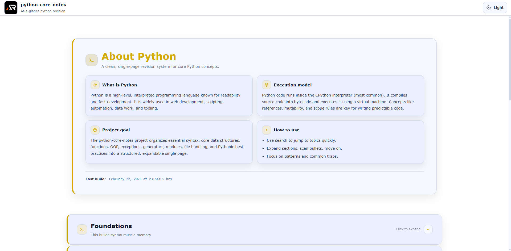

# Operating Systems Core Notes

A single-page, at-a-glance revision project for core Operating System concepts.

This project is designed as a fast reference and structured summary sheet covering essential OS topics without unnecessary depth.  
It focuses on clarity, system-level thinking, real-world execution flow, and interview-ready fundamentals.

---



---

## Purpose

- Quick revision before interviews
- Rapid recall of core OS concepts
- Clear mental model of process execution, memory flow, and hardware interaction
- Practical, production-focused reminders
- Strong foundation in processes, scheduling, memory, synchronization, and file systems without overload

## Coverage

- What is an Operating System
- OS goals and responsibilities
- Kernel basics and architecture types
- User mode vs Kernel mode
- System calls (process, file, device, memory)

- Process vs Thread
- Process states and lifecycle
- Process Control Block basics
- Context switching

- CPU Scheduling
    - FCFS
    - SJF
    - Round Robin
    - Priority Scheduling
    - Multilevel Queue
- Scheduling metrics
    - Turnaround time
    - Waiting time
    - Response time
    - Throughput

- Synchronization
    - Critical section
    - Race condition
    - Mutex
    - Semaphore

- Deadlocks
    - Four necessary conditions
    - Prevention and avoidance overview
    - Detection and recovery basics

- Memory Management
    - Address space
    - Paging vs Segmentation
    - Virtual memory
    - Page faults
    - Thrashing concept

- File Systems
    - Files and directories
    - Metadata
    - Permissions model
    - Basic allocation ideas

- I/O Basics
    - Blocking vs Non-blocking
    - Interrupts
    - Disk scheduling overview (SCAN, C-SCAN)

- Must-know interview questions and answers

## Tech Stack

- React
- Vite
- styled-components

## Project Type

Single page only  
Section-based navigation  
Searchable and expandable content  
No blog-style content, only structured notes

Each topic is modular and collapsible for fast scanning.

## Run Locally

```bash
npm install
npm run dev
```

## Build

```bash
npm run build
```

## Deploy (GitHub Pages)

Make sure the Vite `base` matches the repository name.

```bash
npm run deploy
```

## Goal

Complete core Operating Systems knowledge in one scrollable page.

No fluff.  
No repetition.  
Just system-level clarity.
