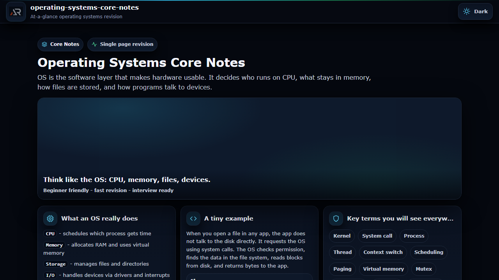

# Operating Systems Core Notes

A focused single-page revision guide for core Operating Systems concepts, from processes and CPU scheduling to memory, synchronization, deadlocks, file systems and I/O.



## Features

- Structured notes grouped by major Operating Systems topics
- Expandable topic sections and interview-focused questions
- Dark and light theme support with local persistence
- Fixed header with local branding and independent page scrolling
- Icon-only social and support footer with a floating go-to-top control

## Tech stack

React, Vite, styled-components and React Icons.

## Run locally

```bash
npm install
npm run dev
```

## Deploy

```bash
npm run build
npm run deploy
```

Live site: [Operating Systems Core Notes](https://a2rp.github.io/operating-systems-core-notes/)

## Links

- Portfolio: [https://www.ashishranjan.net/](https://www.ashishranjan.net/)
- GitHub: [https://github.com/a2rp](https://github.com/a2rp)
- CodePen: [https://codepen.io/ash1198](https://codepen.io/ash1198)
- LinkedIn: [https://www.linkedin.com/in/aashishranjan](https://www.linkedin.com/in/aashishranjan)
- Facebook: [https://www.facebook.com/theash.ashish/](https://www.facebook.com/theash.ashish/)
- YouTube: [https://www.youtube.com/@ashishranjan-ashz?sub_confirmation=1](https://www.youtube.com/@ashishranjan-ashz?sub_confirmation=1)
- Email: [mailto:ash.ranjan09@gmail.com](mailto:ash.ranjan09@gmail.com)

## Support

- Support: [https://a2rp-donation-page.netlify.app/](https://a2rp-donation-page.netlify.app/)
- Buy Me a Coffee: [https://buymeacoffee.com/a2rp](https://buymeacoffee.com/a2rp)
- Patreon: [https://patreon.com/a2rp](https://patreon.com/a2rp)